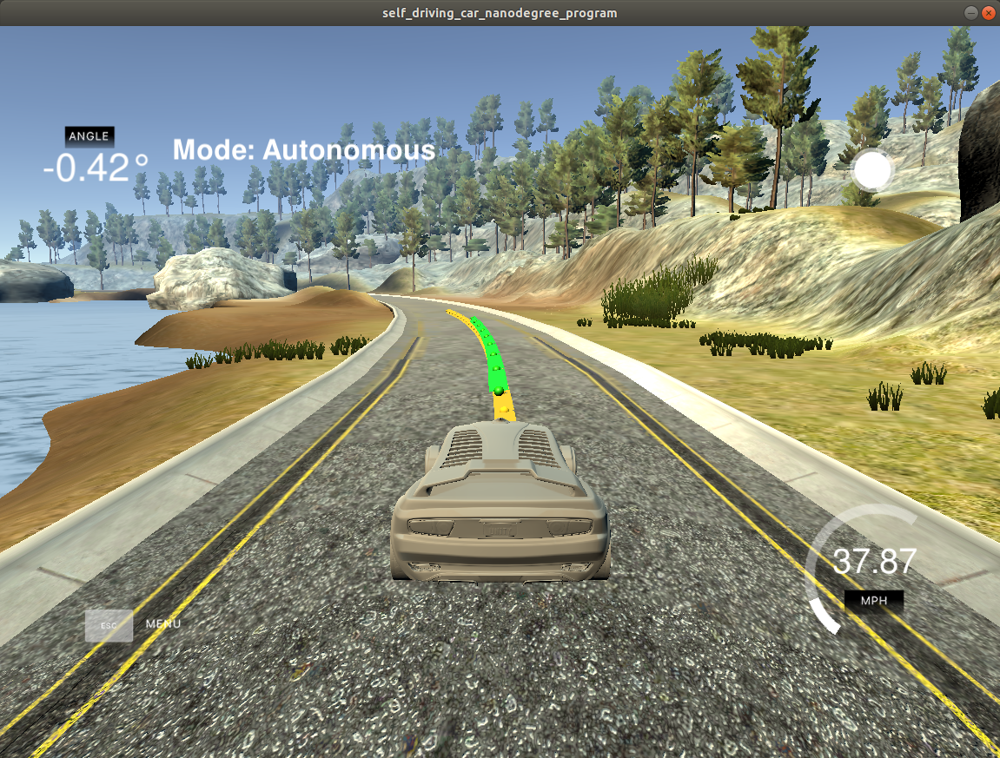
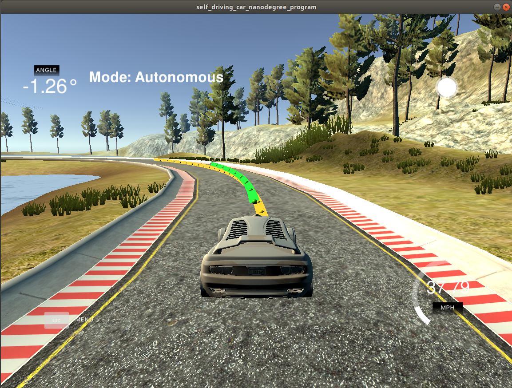
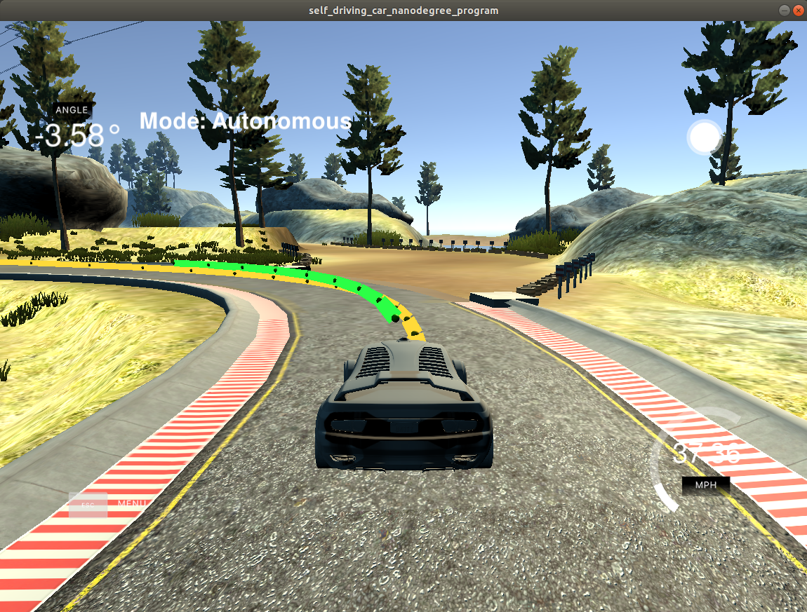
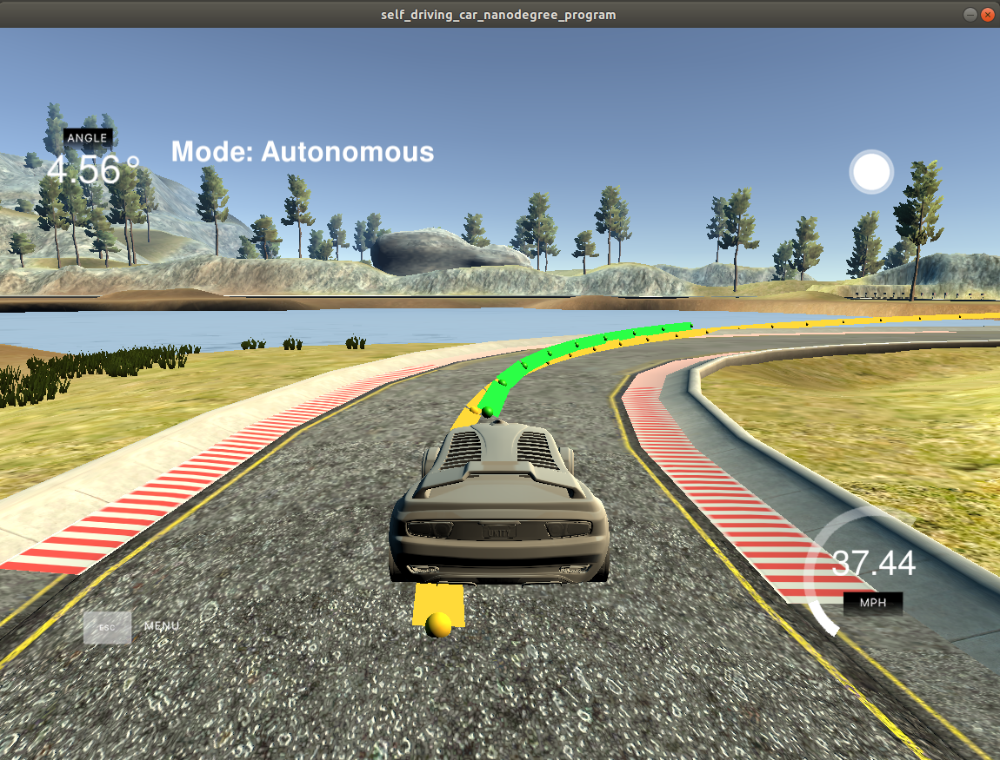

# CarND-Controls-MPC
---

The project consists on implementing a Model Predictive Control (MPC) to drive a car around a track autonomously without leaving the track borders. The car will follow a reference trajectory (center of the lane) and minimize its distance with respect to the reference line.

## Dependencies

* cmake >= 3.5
 * All OSes: [click here for installation instructions](https://cmake.org/install/)
* make >= 4.1(mac, linux), 3.81(Windows)
  * Linux: make is installed by default on most Linux distros
  * Mac: [install Xcode command line tools to get make](https://developer.apple.com/xcode/features/)
  * Windows: [Click here for installation instructions](http://gnuwin32.sourceforge.net/packages/make.htm)
* gcc/g++ >= 5.4
  * Linux: gcc / g++ is installed by default on most Linux distros
  * Mac: same deal as make - [install Xcode command line tools]((https://developer.apple.com/xcode/features/)
  * Windows: recommend using [MinGW](http://www.mingw.org/)
* [uWebSockets](https://github.com/uWebSockets/uWebSockets)
  * Run either `install-mac.sh` or `install-ubuntu.sh`.
  * If you install from source, checkout to commit `e94b6e1`, i.e.
    ```
    git clone https://github.com/uWebSockets/uWebSockets
    cd uWebSockets
    git checkout e94b6e1
    ```
    Some function signatures have changed in v0.14.x. See [this PR](https://github.com/udacity/CarND-MPC-Project/pull/3) for more details.

* **Ipopt and CppAD:** Please refer to [this document](https://github.com/udacity/CarND-MPC-Project/blob/master/install_Ipopt_CppAD.md) for installation instructions.
* [Eigen](http://eigen.tuxfamily.org/index.php?title=Main_Page). This is already part of the repo so you shouldn't have to worry about it.
* Simulator. You can download these from the [releases tab](https://github.com/udacity/self-driving-car-sim/releases).
* Not a dependency but read the [DATA.md](./DATA.md) for a description of the data sent back from the simulator.


## Basic Build Instructions

1. Clone this repo.
2. Make a build directory: `mkdir build && cd build`
3. Compile: `cmake .. && make`
4. Run it: `./mpc`.

## The Model Predictive Control

The idea of the model is to compute and apply the actuators (acceleration and steering angle) for the next movement of the car. The actuators are calculated using the current state of the car. The model calculates (predicts) a moving trajectory based on a reference trajectory (ideal line that the car should follow). The car state involves the following variables:

* x: car position in the x axis
* y: car position in the y axis
* v: car velocity
* psi: heading direction
* cte: cross track error that represents the distance between the calculated trajectory and the reference
* epsi: orientation error of the car

The model reduces the cte and epsi; it is a kinematic bicycle model and these are the equations of the model:
```
x_[t+1] = x[t] + v[t] * cos(psi[t]) * dt
y_[t+1] = y[t] + v[t] * sin(psi[t]) * dt
psi_[t+1] = psi[t] + v[t] / Lf * delta[t] * dt
v_[t+1] = v[t] + a[t] * dt
cte[t+1] = f(x[t]) - y[t] + v[t] * sin(epsi[t]) * dt
epsi[t+1] = psi[t] - psides[t] + v[t] * delta[t] / Lf * dt
```

## Timestep Length N and Elapsed Duration dt

These parameters define the prediction horizon. N is the number of timesteps in the horizon and dt is how much time elapses between actuations. By selecting a short number of points (N) the prediction is less accurate. By selecting a high number of points impacts the performance of the simulator but it enhances the control and prediction of the car trajectory. Larger values of dt result in less frequent actuations, which makes it harder to accurately approximate a continuous reference trajectory and the control is loose. Giving this and after doing some testing, a value of N=10 and dt=0.1 works fine to drive around the track.

## Polynomial Fitting and MPC Preprocessing

Before calculating the predicted trajectory (it is represented by a 3rd-degree polynomial), the map coordinates are transformed to vehicle coordinates. The coordinates of waypoints in vehicle coordinates are obtained by first shifting the origin to the current poistion of the vehicle and a subsequet 2-D rotation to align the x-axis with the heading direction.

The transformation used is:
```
car_coordinate x = cos(psi) * (ptsx[i] - x) + sin(psi) * (ptsy[i] - y);
car_coordinate y = -sin(psi) * (ptsx[i] - x) + cos(psi) * (ptsy[i] - y);

where x,y is the car position in the map and ptsx,ptsy represents the map waypoints.
```

## Model Predictive Control with Latency

The state of the car is calculated using the Model Predictive Control with Latency, that means there is a delay when the actuators are applied to the car to mimic real conditions of driving.

## Final track

The car is able to drive sucessfully around the track without getting out of it:

 
 
